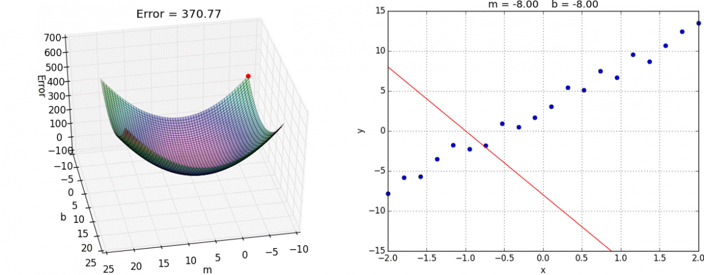

<script type="text/javascript" src="http://cdn.mathjax.org/mathjax/latest/MathJax.js?config=default"></script>
# Regressão Linear
O objetivo da Regressão linear é minimizar a função de custo ( cost function ) ou função de perda ( loss function ) ,  quando a função de perda $J(\theta)$ possui valor baixo, teremos boas predições em novas observações.

Função de perda quadrática:
$$ J(\theta) = \frac{1}{2m} \sum_{i=1}^m \left( h_{\theta}(x^{(i)}) - y^{(i)}\right)^2$$

onde a hipótese $h_\theta(x)$ é  :
$$ h_\theta(x) = \theta^Tx = \theta_0 + \theta_1 x_1$$

Os parâmetros do modelo são valores de $\theta_j$ , esses valores serão ajustados para minimizar a função de perda $J(\theta)$, uma maneira de minimizar a função de perda é o Método do Gradiente.


* ### Método do Gradiente Descendente
Gradiente descendente é um algoritmo de otimização que ajusta os parâmetros de forma iterativa com o objetivo de minimizar a função de interesse.

 $$\text{A cada iteração é atualizado o parametro }\theta_j  \text{ para todos }j$$
 $$\theta_j = \theta_j - \alpha \frac{1}{m} \sum_{i=1}^m \left( h_\theta(x^{(i)}) - y^{(i)}\right)x_j^{(i)} \qquad $$

Cada etapa da descida do gradiente os valores de $\theta_j$ são atualizados convergindo para um mínimo local.



* ### Feature Normalization
Algoritmos que utilizam a método do gradiente para otimização como a regressão linear , tendem a convergir para um melhor resultado com dados na mesma ordem de grandeza.

Para realizar a padronização , utiliza-se a fórmula Z-score:

$$z = \frac {(x - u)}σ$$ 
u = média 
σ = desvio padrão 

* ### Equação Normal

## Respostas

1.  Plotting the Data
```python
def plotData(x, y):
    fig = pyplot.figure()  # open a new figure
    
    # ====================== YOUR CODE HERE ======================= 
    pyplot.plot(x, y, 'ro', ms=10, mec='k')
    pyplot.ylabel('Profit in $10,000')
    pyplot.xlabel('Population of City in 10,000s')
    # =============================================================
```
2. Computing the cost  𝐽(𝜃)
 ```python
 def computeCost(X, y, theta):
    # initialize some useful values
    m = y.size  # number of training examples
    
    # You need to return the following variables correctly
    J = 0
    
    # ====================== YOUR CODE HERE =====================   
    h = np.dot(X, theta)
    erro_quad = np.power(h - y,2)
    J = 1 / (2*m) * np.sum(erro_quad)  
    return J
    # ===========================================================
```

3. Gradient descent
```python
def gradientDescent(X, y, theta, alpha, num_iters):
 
    # Initialize some useful values
    m = y.shape[0]  # number of training examples
    
    # make a copy of theta, to avoid changing the original array, since numpy arrays
    # are passed by reference to functions
    
    theta = theta.copy()
    J_history = [] # Use a python list to save cost in every iteration
    
    for i in range(num_iters):
        # ==================== YOUR CODE HERE =========================
        h = np.dot(X, theta)
        theta = theta - (alpha / m) * (h - y).dot(X)
        # =============================================================
        
        # save the cost J in every iteration
        J_history.append(computeCost(X, y, theta))
    
    return theta, J_history
   ```
 
 4. Feature Normalization
  ```python
def  featureNormalize(X):
	X_norm = X.copy()
    # =========================== YOUR CODE HERE =====================
    mu=np.mean(X,axis=0)
    sigma=np.std(X, axis=0)
    X_norm = (X - mu)/sigma
    # ================================================================
    return X_norm, mu, sigma
```
  5. Computing the cost / Gradient Descent (multivariate)
  ```Python
    def computeCostMulti(X, y, theta):
	    # Initialize some useful values
		  m = y.shape[0] # number of training examples
    
	    # You need to return the following variable correctly
	    J = 0
    
    # ======================= YOUR CODE HERE ===========================
        h = np.dot(X, theta)
	    erro_quad = np.square(h - y)
	    J = 1 / (2*m) * np.sum(erro_quad) 
    # ==================================================================
	    return J
 ```
   ```Python
    def gradientDescentMulti(X, y, theta, alpha, num_iters):
	    # Initialize some useful values
	    m = y.shape[0] # number of training examples
    
	    # make a copy of theta, which will be updated by gradient descent
	    theta = theta.copy()
    
	    J_history = []
    
	    for i in range(num_iters):
        # ======================= YOUR CODE HERE ==========================
	        h = np.dot(X, theta)
	        theta = theta - (alpha / m) * (h - y).dot(X)
        # =================================================================
        
        # save the cost J in every iteration
	    J_history.append(computeCostMulti(X, y, theta))
    
	    return theta, J_history
 ```
  6. Normal Equations
  ```Python
    def normalEqn(X, y):
	    theta = np.zeros(X.shape[1])
    
    # ===================== YOUR CODE HERE ============================

	    theta = np.dot(np.linalg.pinv(np.dot(X.T, X)) , np.dot(X.T, y))
    
    # =================================================================
	    return theta
 ```
   ```Python
   def normalEqnReg(X, y,lambda_):
	    theta = np.zeros(X.shape[1])
	    L = warmUpExercise(X.shape[1])
	    L[0][0]=0
    # ===================== YOUR CODE HERE ============================

	    theta = np.dot(np.linalg.pinv(np.dot(X.T, X) + lambda_*L) , np.dot(X.T, y))
    
    # =================================================================
	    return theta
 ```
  
